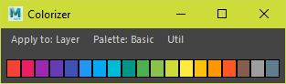
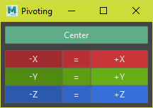

# General Maya Tools

## Code Wall
For the full docs [see here](../tools/codewall.md).

  


###### Run
```python
from dotbloxmaya.general import codewall
codewall.dock.show()
```
## Colorizer
Colorize objects using [material design colors](https://material.io/design/color/the-color-system.html#tools-for-picking-colors)  

  

Applies to `display layers`, `objects` and the `outliner`
###### Run

```python
from dotbloxmaya.general import colorizer
colorizer.dock.show()
```

## Pivoting
Move the pivot relative to the bounding box  



###### Run

```python
from dotbloxmaya.general import pivoting
pivoting.dock.show()
```