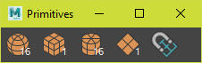

# Maya Modeling Tools

## Beveler
Edit bevel history on the selected mesh.  


###### Run

```python
from dotbloxmaya.modeling import beveler
beveler.dock.show()
```

## .Modeling
One window for primatives, mirrorer and pivoting  


###### Run

```python
from dotbloxmaya.modeling import dotmodeling
dotmodeling.dock.show()
```

## Mirrorer 
Mirror geometry across the `world pivot`, `object pivot` or the `bounding box`  


###### Run

```python
from dotbloxmaya.modeling import mirrorer
mirrorer.dock.show()
```

## Primatives
Create a primitive at the selected components  
Optionally select a face and move the selected objects  



###### Run

```python
from dotbloxmaya.modeling import primitives
primitives.dock.show()
```