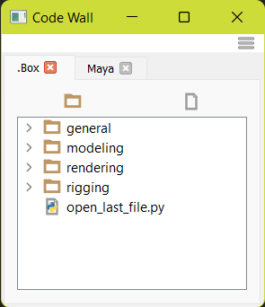

# Code Wall
Easily create a library of snippets in various locations. To run a script 
simply double click from within the interface. To create a script you can 
do this on disk ork quickly through the [Code Editor](#code-editor)

**Available In:**

- [houdini](../houdini/general.md#code-wall)
- [maya](../maya/general.md#code-wall)





## Config
This tool looks for all `codewall.dblx` files across the `PYTHONPATH`. 
All will be loaded into the tool.

### Create New Config
Create a `codewall.dblx` file anywhere on the `PYTHONPATH`. 

This file can be empty or contain:

```json
{
  "__locked__": false,
  "path/to/folder": {
    "label": "Tab Label",
    "edit_path": true,
    "edit_contents": true
  }
}
```

**Minumum Required:** 
```json
{
  "path/to/folder": {
  }
}
```

1. Refresh the interface from the top right menu
2. See [Add To Existing Config](#add-to-existing-config)


###### Global Options:
- **\__locked__**: allows editing of the config file from the UI (default: `false`)

###### Path Options:
- **label:** Display name of the tab. (default: `paths folder name`)
- **edit_path:** allows editing/removal of the path through the UI (default: `true`)
- **edit_contents:** allows editing/removal of the folders contents through the UI (default: `true`)


### Add To Existing Config
1. Underneath the config sub menu. Click the path of your new config.

     - if the config is not editable it will not show up

2. This will pop open the [Config Editor](#config-editor)

### Config Editor

The editor be opened from two ways:

- `Menu` -> `Config` -> `path/to/codewall.dblx `
- `Right Click Tab` -> `Update Settings`


##### Label:
The tab display name. If left blank the folder name will be used  
##### Path: 

- **absolute path:** Can be a direct path to the folder
- **relative path:** This can be a direct path or a relative path to the current 
config file  
You can use the `Relative Path` check box to automatically make it relative.  
This option is useful if you keep your config and scripts together within 
the same folder structure.  
(e.g. `../relative/path/to/folder`)
- **environment variables**: Environment variables can be used within the path.  
(e.g. the path can be set to `$MAYA_APP_DIR/scripts` and this will point 
to a scripts folder under the maya directory). Variable must start with `$`  


## Code Editor
When modifying/creating a new script from within the tool this dialog will popup.


### Hot Keys
- `CTRL + ENTER`: Execute Selection

### Executing

- **Execute:** runs the entire script.
- **Execute Selection:** This will execute all the lines that are within
the selection.

!!! info
    Attempting to close the dialog without saving changes will prompt you to save.  
    Renaming the file will ask you to confirm the name change.

!!! warning
    This will **NOT** be saved by `CTRL + S`. 


## Menu Options
- **Read Only:** With this enabled you will be unable to drag and drop
items within the interface. (i.e. This will move files around on disk.)
- **Config:** list all the current configs loaded into the UI. 
Select one to open the [Config Editor](#config-editor).
- **Refresh:** reloads the interface and searches for new config files.

## Context Menu Options
Some options may not be visible based on the config

- **Run:** execute the selected script.
- **New Folder:** create a new folder at the selected path.
- **New Script:** create a new script at the selected path.
- **Modify:** open the [Code Editor](#code-editor) with the current script.
- **Rename:** rename the selected item.
- **Delete:** delete the selected item. 

## Deleting Items
Deleting is **PERMANENT**. There is no recycle bin.  
This tool has the option to `Archive` instead. This will create an `__archive`
folder in the current directory and copy items to this instead. (Currently, this does not get hidden from the interface.)
The selected item for deletion will be renamed to `item_name.YYYMMDD.ext`
