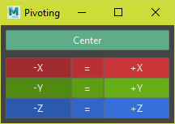
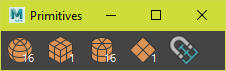

# [.Blox](../../README.md) > [Maya](./maya.md) > Tools

## General

### Colorizer
Colorize objects using [material design colors](https://material.io/design/color/the-color-system.html#tools-for-picking-colors)  
  

Applies to `display layers`, `objects` and the `outliner`
###### Run
```python
from dotblox.general import colorizer
colorizer.dock.show()
```

### Pivoting
Move the pivot relative to the bounding box  


###### Run
```python
from dotblox.general import pivoting
pivoting.dock.show()
```

## Modeling

### Beveler
Edit bevel history on the selected mesh.  


###### Run
```python
from dotblox.modeling import beveler
beveler.dock.show()
````

### Mirrorer 
Mirror geometry across the `world pivot`, `object pivot` or the `bounding box`  


###### Run
```python
from dotblox.modeling import mirrorer
mirrorer.dock.show()
```

### Primatives
Create a primitive at the selected components  
Optionally select a face and move the selected objects 


###### Run
```python
from dotblox.modeling import primitives
primitives.dock.show()
```